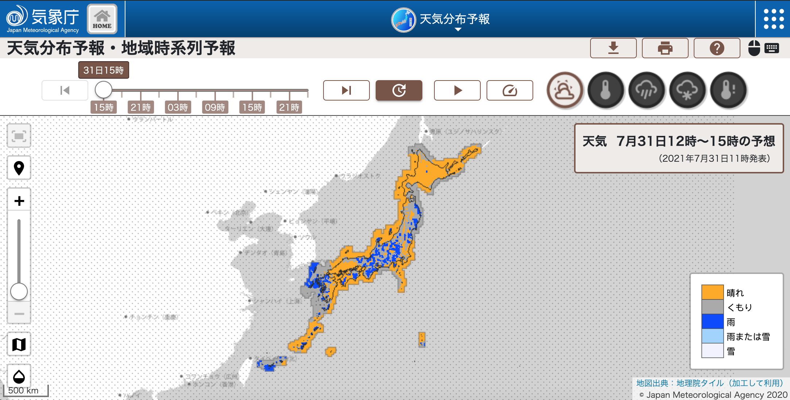
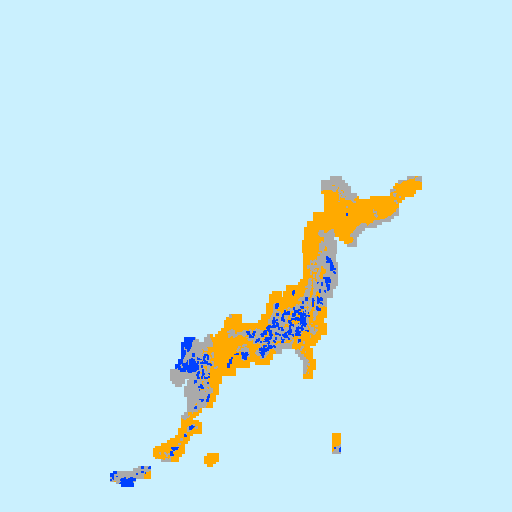
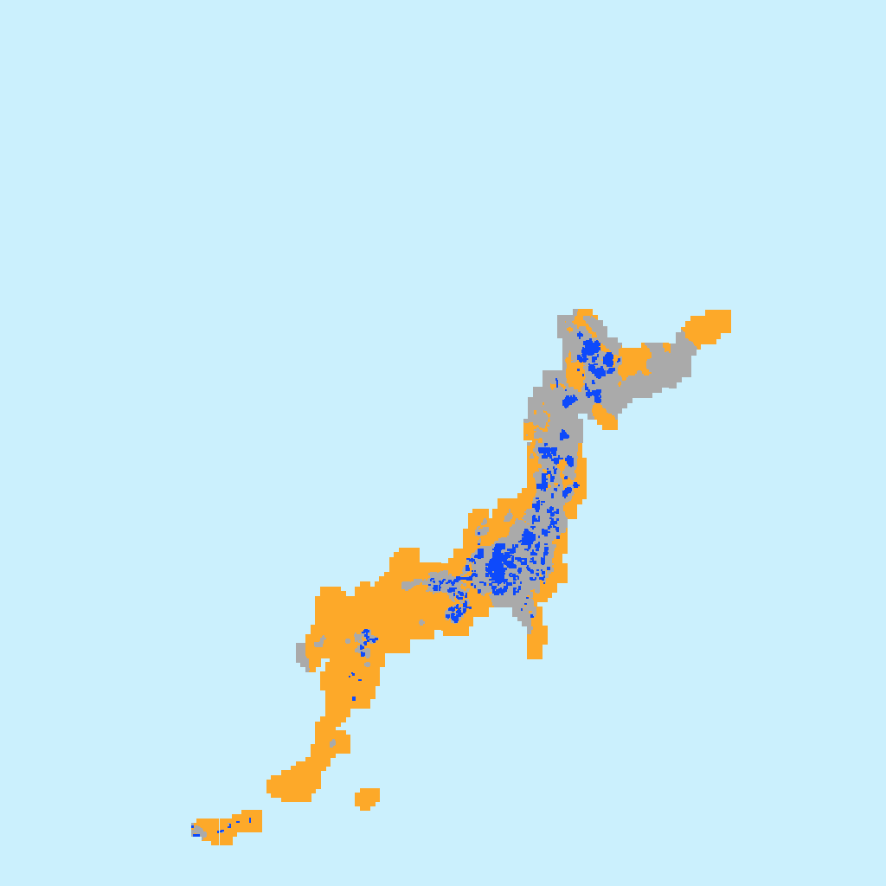
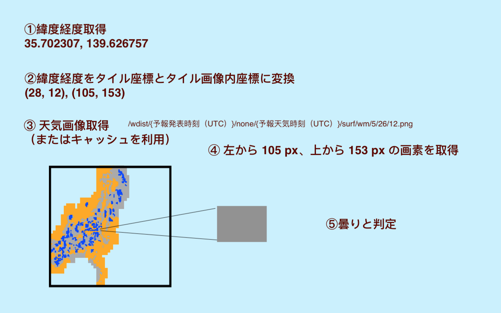

# Location Weather API

気象庁の天気分布予報と高解像度ナウキャストを用いて、ある地点の直近の天気予報と降雨量を取得する API サーバー。


## 注意

このリポジトリに含まれるプログラムは個人利用を想定したもので、商用利用を想定したものではありません。気象庁のリソースは気象庁のホームページを確認の上利用していください。


## Run

On localhost (http://localhost:49133/docs).

```
docker-compose -f docker-compose.local.yml up -d 
```

On remote server.

```
docker-compose up -d
```


## Examples

### Location Weather Forecast

Request

```
$ curl -X 'POST' \
  'http://localhost:49133/location_weather_forecast' \
  -H 'accept: application/json' \
  -H 'Content-Type: application/json' \
  -d '{"lat": 26.206998, "lon": 127.65174}'
```

Response

```
{
  "weather": "cloudy",
  "location": {
    "lat": 26.206998,
    "lon": 127.65174
  },
  "tile_position": {
    "location": {
      "lat": 26.206998,
      "lon": 127.65174
    },
    "zoom": 5,
    "x": 27.346821333333335,
    "y": 13.584736664484332,
    "tile_x": 27,
    "tile_y": 13,
    "pixel_x": 88,
    "pixel_y": 149
  },
  "now": "2021/08/02 09:50:45",
  "utc": "2021/08/02 00:50:45",
  "observation_timestamp": "20210801200000",
  "forecast_timestamp": "20210802000000",
  "image_url": "https://www.jma.go.jp/bosai/jmatile/data/wdist/20210801200000/none/20210802000000/surf/wm/5/27/13.png"
}
```

### Location Rainfall

Request

```
$ curl -X 'POST' \
  'http://localhost:49133/location_rainfall' \
  -H 'accept: application/json' \
  -H 'Content-Type: application/json' \
  -d '{"lat": 33.903307, "lon": 130.933741}'
```

Response

```
{
  "rainfall": 0,
  "location": {
    "lat": 33.903307,
    "lon": 130.933741
  },
  "tile_position": {
    "location": {
      "lat": 33.903307,
      "lon": 130.933741
    },
    "zoom": 9,
    "x": 442.2168760888889,
    "y": 204.6936493340127,
    "tile_x": 442,
    "tile_y": 204,
    "pixel_x": 55,
    "pixel_y": 177
  },
  "now": "2021/08/02 09:51:12",
  "utc": "2021/08/02 00:51:12",
  "observation_timestamp": "20210802005000",
  "forecast_timestamp": "20210802005000",
  "image_url": "https://www.jma.go.jp/bosai/jmatile/data/nowc/20210802005000/none/20210802005000/surf/hrpns/9/442/204.png"
}
```


## Unit Test

After starting the server.

```
docker-compose -f docker-compose.local.yml exec app python test_main.py
```


## 直近の天気予報の取得方法

気象庁の [天気分布予報](https://www.jma.go.jp/bosai/wdist/) では、毎日 5 時、11 時、17 時に発表された 3 時間ごとの 5km メッシュ内の代表的な天気の予報を見ることができる（[気象庁 | 天気分布予報の解説](https://www.jma.go.jp/jma/kishou/know/kurashi/bunpu.html)）。



(気象庁の天気予報分布の画面キャプチャ)

天気分布予報のページに表示される地図は、白地図や 5km メッシュごとの天気予報で色分けした画像等が重ねて表示されている。白地図と天気予報画像は[地理院タイル](https://maps.gsi.go.jp/development/siyou.html) をベースにしており、以下のような URL でそれぞれ画像を取得できる。

白地図

* https://www.jma.go.jp/bosai/jmatile/data/map/none/none/none/surf/mask/4/14/5.png


(白地図のサンプル)

天気予報画像

* https://www.jma.go.jp/bosai/jmatile/data/wdist/20210730080000/none/20210730120000/surf/wm/4/14/5.png


(天気予報画像のサンプル)

画像 URL の末尾のスラッシュで区切られた 3 つの数字はそれぞれタイルの zoom レベル, x 座標, y 座標を表している。また、天気予報画像の URL に現れるタイムスタンプは、1 つ目が予報発表時刻（UTC）、2 つ目が予報天気時刻（UTC）となっている。

> https://www.jma.go.jp/bosai/jmatile/data/wdist/{予報発表時刻（UTC）}/none/{予報天気時刻（UTC）}/surf/wm/{zoom}/{x}/{y}.png

これらの情報から、以下の手順で、指定緯度経度の直近の天気予報を取得できると考える。

1. 緯度経度をタイル座標とタイル画像内ピクセル座標に変換
    - 方法は以下を参照（OpenStreetMap の Wiki と QA フォーム）
    - https://wiki.openstreetmap.org/wiki/Slippy_map_tilenames
    - https://help.openstreetmap.org/questions/747/given-a-latlon-how-do-i-find-the-precise-position-on-the-tile
1. 当該タイル座標の天気予報画像を取得
1. 天気予報画像内の当該ピクセル座標の色を取得
1. 色を天気種別に変換

この時、取得する天気予報画像の zoom レベルは 5 のものを使う。理由としては、天気予報画像が 5km メッシュで定義されているためである。5km メッシュは 5 倍地域メッシュ（[第1章 地域メッシュ統計の特質・沿革 - 総務省統計局](https://www.stat.go.jp/data/mesh/pdf/gaiyo1.pdf)）で定義されていると推測される（出典なし）。

5 倍地域メッシュの場合、日本の西端から東端までは 432 メッシュに、北端から南端（先島諸島）までは 544 メッシュに分割される。

* 1 次メッシュ定義画像 https://www.stat.go.jp/data/mesh/pdf/m-kukaku.pdf
* 目視で数えると x 軸メッシュ数 27、y 軸メッシュ数 34
* 1 次メッシュは約 80km 四方のメッシュなので、1 つの 1 次メッシュは一辺 16 つの 5km メッシュに分割される
* x 軸は 27 * 16 = 432、y 軸は 34 * 16 = 544 という計算

これに対して、天気予報画像が日本をカバーしているピクセル数は zoom レベル 4 の場合縦 358 横 308、レベル 5 の場合縦 624 横 616 で（目視で確認）、レベル 5 の場合 1 ピクセルあたり 5km メッシュを表現できていると考えられる。また、zoom レベル 5 の日本をカバーする天気予報画像はたった 6 枚なのでサーバーへの負荷も比較的低いと考えられる。



(zoom レベル 4 の画像。実際の天気予報画像を粗く繋ぎ合わせたもの。512 x 512 ピクセルで、日本をカバーしているピクセルはもっと少ない)



(zoom レベル 5 の画像。実際の天気予報画像を粗く繋ぎ合わせたもの。1024 x 1024 ピクセルで、日本をカバーしているピクセル数は縦 544 を超える)

以下は、天気予報取得手順を図で表現したもの。




## 直近の降雨量の取得方法

気象庁の [高解像度ナウキャスト](https://www.jma.go.jp/bosai/nowc/) では、250m メッシュで降水の短時間予報を提供している（[気象庁 | 高解像度ナウキャスト](https://www.jma.go.jp/jma/kishou/know/kurashi/highres_nowcast.html)）。

降水予測画像は天気分布予報と同じ仕組みで表示されている。


(降水予測画像のサンプル)

そのため、同じ手順でリアルタイムの降雨状況を取得できると考えらえる。

ただし、250m メッシュ、すなわち、5次メッシュなので、最低限の位置精度を得るために、zoom レベルは上げる必要がある。250m メッシュは 5km メッシュの 1/20 のサイズなので、8640メッシュに分割される。これをカバーするためには、zoom レベルを 9 に上げる必要があり（大雑把に、レベル 4 で 300 ピクセル四方、5 で 600 なら...という考え）、日本をカバーするには 100 枚以上必要だと予測され、さらに、画像の更新頻度が天気予報よりも高いので、サーバー負荷に注意が必要。
